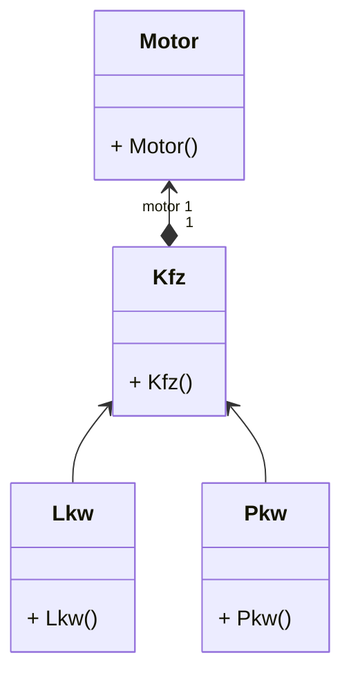

## Test Mermaid Diagrams

```mermaid
classDiagram
direction BT
class Kfz {
  + Kfz() 
}
class Lkw {
  + Lkw() 
}
class Motor {
  + Motor() 
}
class Pkw {
  + Pkw() 
}

Kfz "1" *--> "motor 1" Motor 
Lkw  -->  Kfz 
Pkw  -->  Kfz 


```